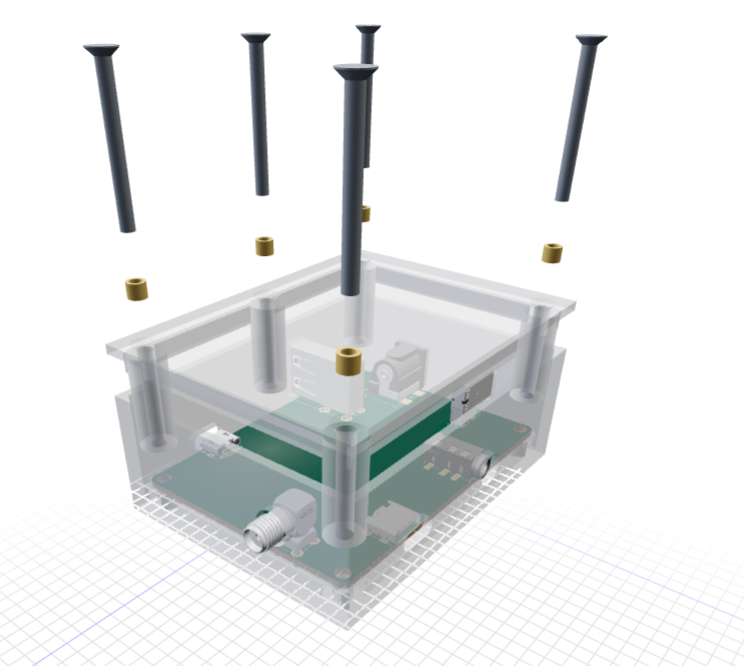

# pcb-enclosure

Generate an FDM-first enclosure from a rendered tscircuit board. The current
`main` implementation builds a two-part split shell (`base` + `lid`) from the
board outline, mounting holes, component heights, and connector placement.



## What is available on `main`

- Board-driven shell sizing with configurable wall, floor, lid, clearance,
  standoff, headroom, and lid-lip dimensions.
- Optional outer `width`, `height`, and `depth` overrides from the upstream
  `enclosure.fdm.box` props contract.
- PCB mounting posts at compatible board holes using a data-driven hardware
  stack (M3 heat-set by default).
- External corner fastening ears when mounting holes do not cover the corners.
- Automatic placement of explicitly declared connector apertures.
- Visible bushings and screws with a toggleable exploded assembly view.
- Seated-assembly and board-insertion collision checks.
- Read-only canonical Circuit JSON input with ephemeral enclosure specs.
- Standalone enclosure GLB, STL, and combined PCB/enclosure preview output.

There is no public `<enclosure>` intrinsic or canonical Circuit JSON enclosure
record. The imported namespace records a package-private spec associated with
the active circuit; the artifact renderer consumes canonical Circuit JSON after
the board has rendered.

## Required modified upstreams

This repository currently depends on coordinated changes that have **not all
been released by upstream tscircuit packages**. A checkout using only published
package versions is not sufficient. To build and run the current implementation,
use these addibble-owned branches together:

| Repository branch | Required capability |
| --- | --- |
| Local `core:rfc/parametric-enclosures` | Generic external React host elements, mounting-origin preservation, and CAD model size metadata. |
| Local `circuit-json-util:rfc/parametric-enclosures` | Transform `pcb_component.anchor_position` with component/group layout. |
| [`@tscircuit/props@0.0.580`](https://github.com/tscircuit/props/releases/tag/v0.0.580) | Merged `enclosure.fdm.box` and `enclosure.cutoutaperture` contracts from [#733](https://github.com/tscircuit/props/pull/733) and [#732](https://github.com/tscircuit/props/pull/732). |
| [`addibble/infer-cable-insertion-point:fix/explicit-insertion-direction`](https://github.com/addibble/infer-cable-insertion-point/tree/fix/explicit-insertion-direction) | Explicit mating direction takes precedence over geometry guessing. |
| [`addibble/eval:enclosure-support`](https://github.com/addibble/eval/tree/enclosure-support) | Optional preview-artifact protocol, runtime props schemas, and bundled JSCAD/GLB modules. |
| [`addibble/runframe:enclosure-support`](https://github.com/addibble/runframe/tree/enclosure-support) | Blob-backed enclosure GLB artifacts composed only into the CAD preview. |
| [`addibble/3d-viewer:enclosure-support`](https://github.com/addibble/3d-viewer/tree/enclosure-support) | GLB rendering plus the current enclosure-viewer compatibility work. |
| [`addibble/jscad-electronics:fix/connected-right-angle-pinrow`](https://github.com/addibble/jscad-electronics/tree/fix/connected-right-angle-pinrow) | Correct connected geometry for inverted right-angle pin rows. |

The local development setup uses these repositories as sibling checkouts and
links their builds into the dependency graph. See
[`UPSTREAM-FIXES.md`](./UPSTREAM-FIXES.md) for the problem statement, exact files,
compatibility analysis, tests, and publication status of every upstream change.

## Element usage

`<enclosure.fdm.box />` is an assembly-level sibling of `<board />`:

```tsx
import { enclosure } from "pcb-enclosure"

export default () => (
  <group>
    <board name="B1" width="50mm" height="36mm">
      <hole pcbX={-20} pcbY={-13} diameter="3.2mm" />
      <hole pcbX={20} pcbY={-13} diameter="3.2mm" />
      <hole pcbX={20} pcbY={13} diameter="3.2mm" />
      <hole pcbX={-20} pcbY={13} diameter="3.2mm" />
    </board>

    <enclosure.fdm.box name="EN1" boardRef=".B1" autoCutouts />
  </group>
)
```

Supported props:

| Prop | Purpose |
| --- | --- |
| `boardRef` | Select the board to enclose, such as `.B1`. |
| `width` / `height` | Optional outer X/Y dimensions; inferred from the board and clearances when omitted. |
| `depth` | Optional total outer Z dimension; inferred from the PCB/component stack when omitted. |
| `wallThickness` | Printed side-wall thickness. |
| `floorThickness` | Base floor thickness. |
| `lidThickness` | Lid top-plate thickness. |
| `boardClearance` | XY gap from PCB edge to inner wall. |
| `standoffHeight` | Gap from floor top to PCB bottom. |
| `topHeadroom` | Clearance above the tallest top-side component. |
| `lidLipDepth` | Depth of the friction-fit lid lip. |
| `anchor` | Mounting stack key, such as `m3-heat-set` or `m2-self-tap`. |
| `autoCutouts` | Place wall/lid openings declared by parts; never infer aperture existence or geometry. |

## Part metadata and automatic cutouts

Parts carry their nominal opening as a composable child beside their footprint
and CAD model:

```tsx
import { enclosure } from "pcb-enclosure"

<connector name="J1">
  <enclosure.cutoutaperture
    shape="pill"
    width={3.66}
    height={8.34}
    position={{ z: "6.75mm" }}
  />
</connector>
```

The upstream schema supports `pill`, `rect`, and `circle`; circle dimensions use
`radius`. `pcb-enclosure` retains `position` as a backwards-compatible extension
while that placement vocabulary continues to evolve upstream.

`position` is measured in the component's local mounting frame: x/y from the
footprint origin and z from the component-side PCB surface, positive away from
the board. Every axis is optional; enclosure resolution keeps the existing
part-type inference for omitted axes. Position coordinates use ordinary
tscircuit distances, so default-unit numbers and strings such as `"6.75mm"` or
`"0.1in"` can be mixed.

This requires a coordinated data path:

1. `@tscircuit/props` defines the typed `enclosure.cutoutaperture` shape props.
2. Core retains the imported element as a generic, no-output tree node with its
   normal-component parent relationship intact.
3. `pcb-enclosure` collects the node and maps its owner through
   `source_component_id` without writing aperture data to Circuit JSON.
4. The artifact renderer combines that ephemeral aperture map with canonical
   Circuit JSON. Parts without a declaration receive no opening.

The footprint also declares its invariant, part-local `insertionDirection`.
Core rotates that direction with the instance's `pcbRotation` and emits the
global `pcb_component.insertion_direction`. The cable-insertion library honors
that explicit direction before using footprint/silkscreen geometry as a
fallback, then supplies the mating point used to center the opening.

Core also preserves `cadModel.size` on `cad_component.size`. Automatic detection
therefore checks the nearest cable insertion point **or model-body edge**, rather
than rejecting a connector merely because its PCB pins and component origin sit
farther inboard.

The concrete example parts under `examples/parts/` keep their supplier
footprint, silkscreen, CAD alignment, measured model bounds, insertion direction,
and `<enclosure.cutoutaperture>` child together. Because it is ordinary TSX, a reusable
part can compose a default child while allowing callers to supply a replacement
child. Circuit placement code only chooses `pcbX`, `pcbY`, and `pcbRotation`.

## Example gallery

| Example | Exercises |
| --- | --- |
| `prefab-board` | Five M3 PCB posts plus seven connectors with part-embedded aperture profiles, supplier footprints, and OBJ models. |

Build and validate every example:

```bash
bun install
bun run check:examples
```

The checker confirms canonical Circuit JSON contains no enclosure topology, then
verifies the separately rendered base/lid plans, post/ear/cutout counts,
hardware geometry, and seated/insertion clearance.

## Run the web UI

```bash
bun run dev
```

Open <http://localhost:3020>. The command runs the prefab TSX through the local
eval worker. Core produces canonical Circuit JSON, `pcb-enclosure` produces a
separate GLB artifact, and RunFrame adds a temporary GLB-backed CAD component
only to the 3D preview. The Circuit JSON tab and callbacks remain canonical.

In RunFrame:

Select **3D** to inspect the assembled enclosure and PCB together. Drag to orbit,
scroll to zoom, and use the context menu for camera controls or **Download
GLTF**.

Use another port when needed:

```bash
bun run dev -- --port 3026
```

## Build printable STL files

```bash
bun run build:stl
```

This writes:

- `out/base.stl`
- `out/lid.stl`
- `out/pcb.stl`
- `out/viewer.html`

Open `out/viewer.html` for the standalone layered preview. The command also
prints the enclosure dimensions, mounting-hardware BOM, and collision results.

## Library layers

| Module | Responsibility |
| --- | --- |
| `lib/extract-features.ts` | Circuit JSON to board bounds, mounting points, and component bodies. |
| `lib/placement-solver.ts` | Validate PCB mounts and place uncovered corner fasteners. |
| `lib/cutouts.ts` | Place and validate explicitly declared apertures. |
| `lib/build-enclosure.ts` | Lower the resolved design to split-shell CSG. |
| `lib/render-enclosure.ts` | Pure canonical-Circuit-JSON artifact renderer. |
| `lib/preview-artifact.ts` | Ephemeral spec-to-GLB host adapter. |

## License

MIT
